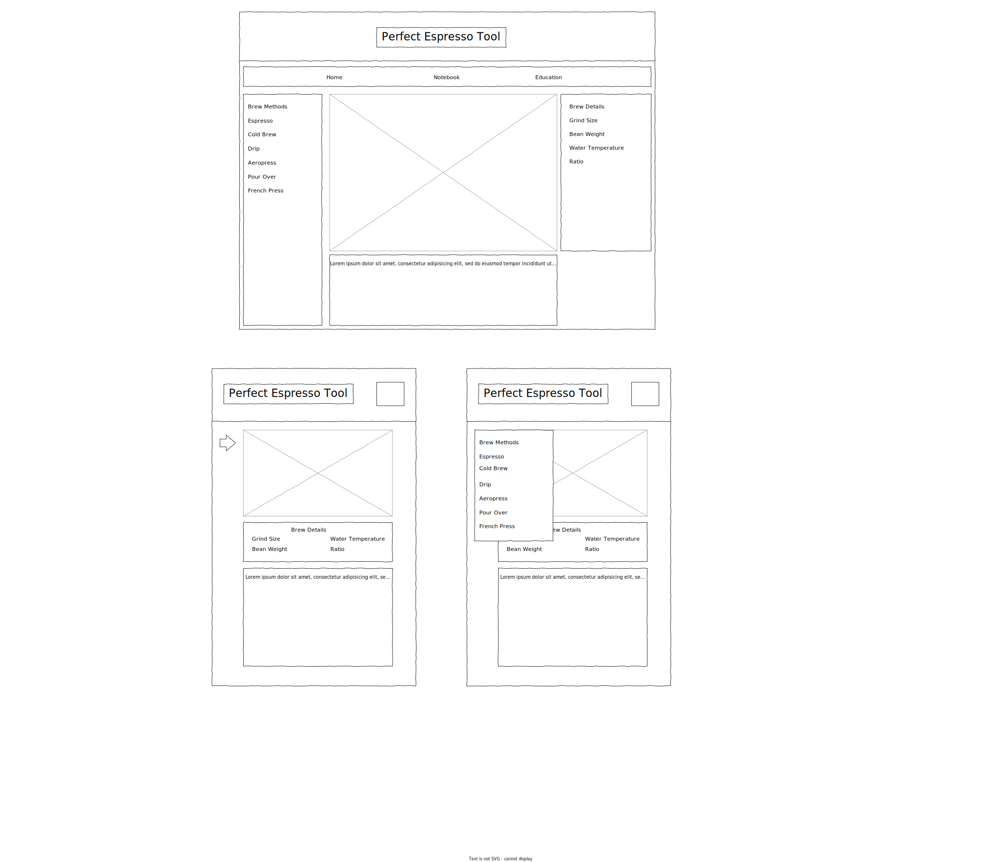

# Perfect Espresso Tool

A Site dedicated to helping users create the perfect shot of espresso

## Technology

- HTML
- CSS
- JavaScript
- jQuery
- jQueryUI
- Flowbite
- TailwindCSS

## User Stories

- As a user, I can look up one suggested recipe for my favorite brew method
- As a user I can add and edit and delete my brew techniques by category to see what worked in the past (local storage)
- As a user I can search Wikipedia for anything coffee related
- As a user I can see the top Reddit post about coffee for the day
- As a user I can buy the developers a coffee
- As a user I can view all of the contributors of a project
- As a user on mobile, the very first thing I see is the brew methods

## Third Party API's Used

- Reddit API to pull top posts from r/coffee
- Wikipedia API for information about coffee and beans (search)
- Buyameacoffee API

## Wireframe

# Color Palette

